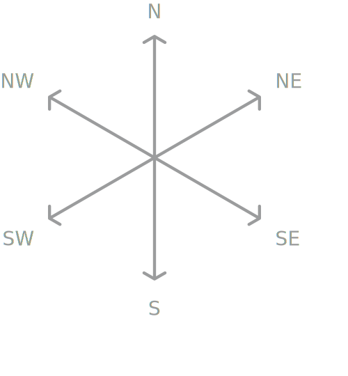

**Draw isometric graphics with code.**

<a href="https://isodoodle.netlify.app" target="_blank" rel="noopener noreferrer">💻 **Try the online editor →**</a>

---

Isodoodle generates clean, minimal SVG markup. No canvas. No WebGL. No runtime.

## Installation

```bash
npm install isodoodle
```

## Quick Start

```typescript
import { isodoodle } from 'isodoodle';

const diamond = isodoodle({ scale: 40, fill: 'teal' })
  .ne(2).se(2).sw(2).nw(2)
  .toSvgString();

document.body.innerHTML = diamond;
```
Gives:


## Isometric grid

The library uses standard coordinates for an isometric grid:



## API

### Factory Function

```typescript
isodoodle(options?: IsoDoodleOptions): IsoDoodle
```

Creates a new IsoDoodle instance.

### Options

| Option | Type | Default | Description |
|--------|------|---------|-------------|
| `scale` | number | 20 | Pixels per unit |
| `stroke` | string | '#000' | Stroke color |
| `strokeLinecap` | 'butt' \| 'round' \| 'square' | 'round' | Stroke linecap |
| `strokeLinejoin` | 'miter' \| 'round' \| 'bevel' | 'round' | Stroke linejoin |
| `strokeWidth` | number | 1 | Stroke width |
| `fill` | string | 'none' | Fill color |
| `width` | number | auto | SVG width |
| `height` | number | auto | SVG height |
| `padding` | number | 10 | Padding around drawing |

### Direction Methods

All direction methods accept an optional `distance` parameter (default: 1).

- `.n(distance?)` - Move North (up)
- `.ne(distance?)` - Move Northeast
- `.se(distance?)` - Move Southeast
- `.s(distance?)` - Move South (down)
- `.sw(distance?)` - Move Southwest
- `.nw(distance?)` - Move Northwest

### Path Control


`moveTo(n, ne, nw)` - Jump to an absolute position without drawing using isometric coordinates: `n` (north), `ne` (northeast), and `nw` (northwest). Values are in grid units and are converted to screen pixels by the library's `scale` option. 

`move(n, ne, nw)` - Move relative to the current position without drawing using isometric coordinates (same coordinate order as `moveTo`).

Both `moveTo` and `move` accept three numeric arguments which are interpreted as counts along the isometric axes rather than direct x/y screen coordinates. For example:
  - `move(1,0,1)` moves 1 unit north and one unit northwest
  - `move(0,2,0)` moves 2 units northeast
  - `move(0,-1,0)` moves 1 unit southwest (the opposite of northeast)

The origin (0,0,0) is where the path was started from.

`path(options?)` - Start new path with optional style overrides

### Output Methods

- `.toSvgString()` - Returns SVG markup string
- `.toElement()` - Returns SVGElement (browser only)
- `.toPathData()` - Returns just the path `d` attribute

## License

MIT

